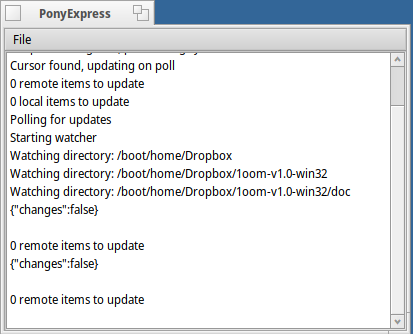
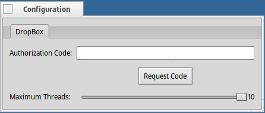

**PonyExpress** for [Haiku](https://www.haiku-os.org/).

A native Dropbox client for Haiku.  It currently uses libcurl for the heavy lifting but is otherwise a pure Haiku app written in C/C++.

This is very alpha software - use at your own risk...  I will not be held responsible if some valuable documents get lost.  There are likely leaks and segfaults, etc. within.

For safeties sake, consider this a magic trash can in that your documents are binned as soon as you drag them in.  If you can't handle that, don't use it.

This software bundles in my Dropbox App key for PonyExpress - if you fork or otherwise adapt the Dropbox handling code from this software, please use your own Dropbox App key instead.  Feel free to borrow the code otherwise, and improvements are most welcome.

### Features

* Automatic syncing of files and folders between a Haiku Dropbox folder and your linked Dropbox account
* PKCE authentication, proper use of tokens, refresh, etc.
* Uses the Dropbox V2 API
* Basic Haiku integration, notifications, etc.

### Main Window

A log of activity and a couple of menu options

This will be going away in future and replaced with a preferences app and improvements to the notifications.

### Configuration Window

Here you can set up your account on Dropbox

- Click on the Request Code button

- Your browser should open up to a link to Dropbox for PonyExpress.  You may need to sign in to your Dropbox account.

- If you authorise PonyExpress, you'll be given some text to paste in.  Paste this in the Authorization Code field.

- You'll need to close this window and restart PonyExpress.  It should then pick up your account and begin syncing between your Dropbox account and the /home/Dropbox folder.  This will be fixed up later.

### Stuff to do
- The code is quite messy and generally pretty horrible
- Allow zipped downloads to improve speed
- Handle operations against folders better (eg. currently deletes each file in a folder, then the folder which isn't optimal.)
- Allow resuming uploads/downloads
- Record queues on exit so pending activity can be resumed generally
- Improve Haiku integration (preferences app or notification area?), re-add notifications
- Handle errors from Dropbox better and recover where possible
- Handle collisions/sync issues
- Potentially support for other cloud syncing services, should their APIs be easy enough to work with and support PKCE with OAUTH or something similar
- Various bugs I haven't discovered yet

### Stuff I probably won't do
- All the extended stuff, Paper, Teams, Requests, etc. support.  I only care about conveniently sharing files between Haiku and my myriad other desktops
